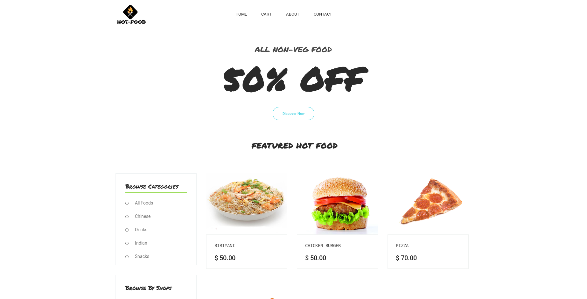
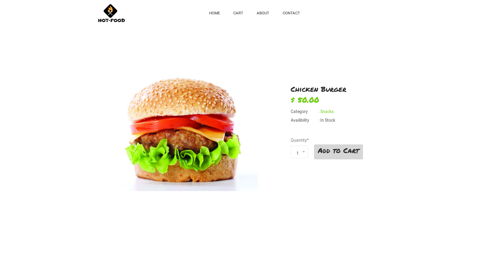

# Hot-Food
> Food Delivery Website built with Django and Bootstrap
# Demo:
##Homepage

##Product page

## Installation:
**1.Clone the Repo**
```sh
git clone https://github.com/shyam999/Hot-Food.git
```
**2.Setup Virtualenv & Install Requirements**
```sh
virtualenv env
source env/bin/activate
pip install -r requirements.txt
```
**3.Set Up RabbitMQ Server**
```sh
sudo apt-get install rabbitmq-server
service rabbitmq-server start
```
**4.Migrate Database**
```sh
python manage.py makemigrations
python manage.py migrate
```
**5.Start Server**
```sh
python manage.py runserver
```
# Contributors
Contributions are welcome, and they are greatly appreciated! Every little bit helps, and credit will always be given.<br/><br/>

Please star the repo and feel free to make pull requests.
