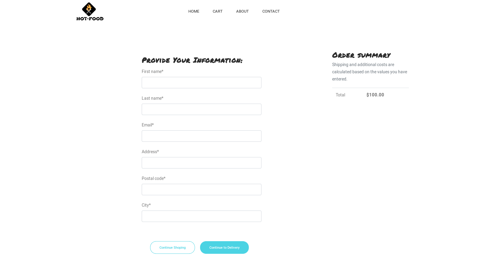

# Hot-Food
> Food Delivery Website built with django
## Installation:

**1.Clone Repo**
```sh
git clone https://github.com/shyam999/Hot-Food.git
```
**2.Setup Virtualenv**
```sh
virtualenv env
source env/bin/activate
```
**3.Install Requirements**
```sh
cd requirements.txt
pip install -r requirements.txt
```
**4.Migrate Database**
```sh
python manage.py makemigrations
python manage.py migrate
```
**5.Create User**
```sh
python manage.py createsuperuser
```
**5.Set Up RabbitMQ**
```sh
sudo apt-get install rabbitmq-server
service rabbitmq-server start
```
**6.Run Server**
```sh
python manage.py runserver
```
# Screenshots:
## Homepage:

## Product Page:

## Address Page:

## Contact Page:

